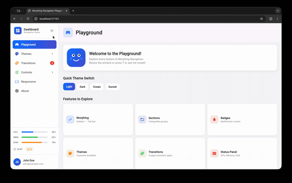

# Morphing Navigation

[](https://pub.dev/packages/morphing_navigation)
[](LICENSE)
[](https://flutter.dev)

An iPadOS-style adaptive navigation widget for Flutter that smoothly morphs between a sidebar layout and a tab bar layout with fluid animations.



## Features

- Smooth morphing animation between sidebar and tab bar layouts
- Responsive — automatically switches modes based on screen width
- Automatic page switching with built-in page management
- Page transitions — fade, slide horizontal, slide vertical
- Fully customizable theme — colors, dimensions, animations, shadows
- Configurable header and footer in sidebar mode
- Section support with expandable/collapsible items
- Badge support for notification indicators
- Glassmorphism effect in tab bar mode
- Icon-only tab bar with tooltip on hover
- Automatic page header showing current page icon and title
- System status panel (CPU, memory, disk usage)
- Keyboard shortcut (`T`) to toggle between modes

## Getting Started

### Installation

Add `morphing_navigation` to your `pubspec.yaml`:

```yaml
dependencies:
  morphing_navigation: ^1.0.0
```

Then run:

```bash
flutter pub get
```

### Platform Support

| Platform | Supported |
|----------|-----------|
| Android  | Yes       |
| iOS      | Yes       |
| Web      | Yes       |
| macOS    | Yes       |
| Windows  | Yes       |
| Linux    | Yes       |

## Usage

### Basic

```dart
import 'package:morphing_navigation/morph_nav.dart';

class MyApp extends StatelessWidget {
  @override
  Widget build(BuildContext context) {
    return MaterialApp(
      home: MorphingNavigationScaffold(
        items: [
          NavItem(id: 'home', label: 'Home', icon: Icons.home),
          NavItem(id: 'search', label: 'Search', icon: Icons.search),
          NavItem(id: 'settings', label: 'Settings', icon: Icons.settings),
        ],
        onItemSelected: (itemId) {
          print('Selected: $itemId');
        },
        child: YourContentWidget(),
      ),
    );
  }
}
```

### Automatic Page Switching

Use `MorphingNavigationScaffold.withPages()` for built-in page management. The scaffold automatically displays the page matching the selected navigation item.

```dart
MorphingNavigationScaffold.withPages(
  items: [
    NavItem(id: 'home', label: 'Home', icon: Icons.home),
    NavItem(id: 'search', label: 'Search', icon: Icons.search),
    NavItem(id: 'settings', label: 'Settings', icon: Icons.settings),
  ],
  initialSelectedId: 'home',
  pageTransitionType: PageTransitionType.fade,
  showPageHeader: true,
  pages: {
    'home': HomePage(),
    'search': SearchPage(),
    'settings': SettingsPage(),
  },
)
```

### Sections (Expandable Items)

```dart
MorphingNavigationScaffold(
  items: [
    NavItem(id: 'home', label: 'Home', icon: Icons.home),
    NavItem(
      id: 'library',
      label: 'Library',
      icon: Icons.photo_library,
      children: [
        NavItem(id: 'photos', label: 'Photos', icon: Icons.photo),
        NavItem(id: 'videos', label: 'Videos', icon: Icons.videocam),
        NavItem(id: 'albums', label: 'Albums', icon: Icons.photo_album),
      ],
    ),
    NavItem(id: 'settings', label: 'Settings', icon: Icons.settings),
  ],
  child: YourContentWidget(),
)
```

### Custom Theme

```dart
MorphingNavigationScaffold(
  items: myItems,
  theme: MorphingNavigationTheme(
    primaryColor: Colors.purple,
    secondaryColor: Colors.pink,
    sidebarWidth: 280.0,
    tabBarHeight: 72.0,
    modeTransitionDuration: Duration(milliseconds: 500),
  ),
  child: YourContentWidget(),
)
```

Built-in presets are available via `MorphingNavigationTheme.light` and `MorphingNavigationTheme.dark`.

### System Status Panel

Display system status information in the sidebar.

```dart
MorphingNavigationScaffold(
  items: myItems,
  status: SystemStatus(
    cpuUsage: 0.45,
    memoryUsage: 0.62,
    diskUsage: 0.78,
    time: DateTime.now(),
    userName: 'John Doe',
    warningCount: 3,
  ),
  child: YourContentWidget(),
)
```

## API Reference

### MorphingNavigationScaffold

The main widget that provides morphing navigation.

| Property | Type | Default | Description |
|----------|------|---------|-------------|
| `items` | `List<NavItem>` | **required** | Navigation items to display |
| `child` | `Widget` | **required** | Main content widget |
| `theme` | `MorphingNavigationTheme?` | `null` | Theme configuration |
| `header` | `MorphingNavHeader?` | `null` | Sidebar header |
| `footer` | `MorphingNavFooter?` | `null` | Sidebar footer |
| `initialSelectedId` | `String?` | `null` | Initially selected item ID |
| `initialExpandedSections` | `Set<String>?` | `null` | Initially expanded section IDs |
| `initialMode` | `MorphingNavigationMode` | `sidebar` | Initial navigation mode |
| `onItemSelected` | `void Function(String)?` | `null` | Selection callback |
| `onModeChanged` | `void Function(MorphingNavigationMode)?` | `null` | Mode change callback |
| `enableKeyboardShortcuts` | `bool` | `true` | Enable keyboard shortcuts |
| `showHeader` | `bool` | `true` | Show sidebar header |
| `showFooter` | `bool` | `true` | Show sidebar footer |
| `status` | `SystemStatus?` | `null` | System status data |

#### MorphingNavigationScaffold.withPages

Same properties as above, replacing `child` with:

| Property | Type | Default | Description |
|----------|------|---------|-------------|
| `pages` | `Map<String, Widget>` | **required** | Page widgets keyed by item ID |
| `pageTransitionType` | `PageTransitionType` | `fade` | Page switch animation |
| `pageTransitionDuration` | `Duration` | `300ms` | Transition duration |
| `showPageHeader` | `bool` | `false` | Show page icon and title header |

### NavItem

| Property | Type | Default | Description |
|----------|------|---------|-------------|
| `id` | `String` | **required** | Unique identifier |
| `label` | `String` | **required** | Display label |
| `icon` | `IconData` | **required** | Icon to display |
| `iconColor` | `Color?` | `null` | Custom icon color |
| `children` | `List<NavItem>?` | `null` | Child items (creates a section) |
| `badge` | `String?` | `null` | Badge text |

### Page Transition Types

| Type | Description |
|------|-------------|
| `PageTransitionType.none` | Instant switch |
| `PageTransitionType.fade` | Fade in/out (default) |
| `PageTransitionType.slideHorizontal` | Slide left/right |
| `PageTransitionType.slideVertical` | Slide up/down |

### Responsive Breakpoints

| Screen Width | Mode |
|--------------|------|
| >= 1024px | Sidebar with labels |
| < 1024px | Tab bar (top, icons only) |
| < 768px | Tab bar (bottom, icons only) |

Breakpoints are configurable via `MorphingNavigationTheme.breakpointLarge` and `MorphingNavigationTheme.breakpointMedium`.

## Example

A full interactive playground app is included in the [`example/`](example/) directory.

```bash
cd example
flutter run
```

## Contributing

Contributions are welcome! Please feel free to submit a [Pull Request](https://github.com/example/morphing_navigation/pulls).

1. Fork the repository
2. Create your feature branch (`git checkout -b feature/my-feature`)
3. Commit your changes (`git commit -m 'Add my feature'`)
4. Push to the branch (`git push origin feature/my-feature`)
5. Open a Pull Request

### Development Setup

```bash
# Clone the repo
git clone https://github.com/example/morphing_navigation.git
cd morphing_navigation

# Get dependencies
flutter pub get

# Run tests
flutter test

# Run the example app
cd example && flutter run

# Analyze code
flutter analyze
```

## License

This project is licensed under the MIT License — see the [LICENSE](LICENSE) file for details.
